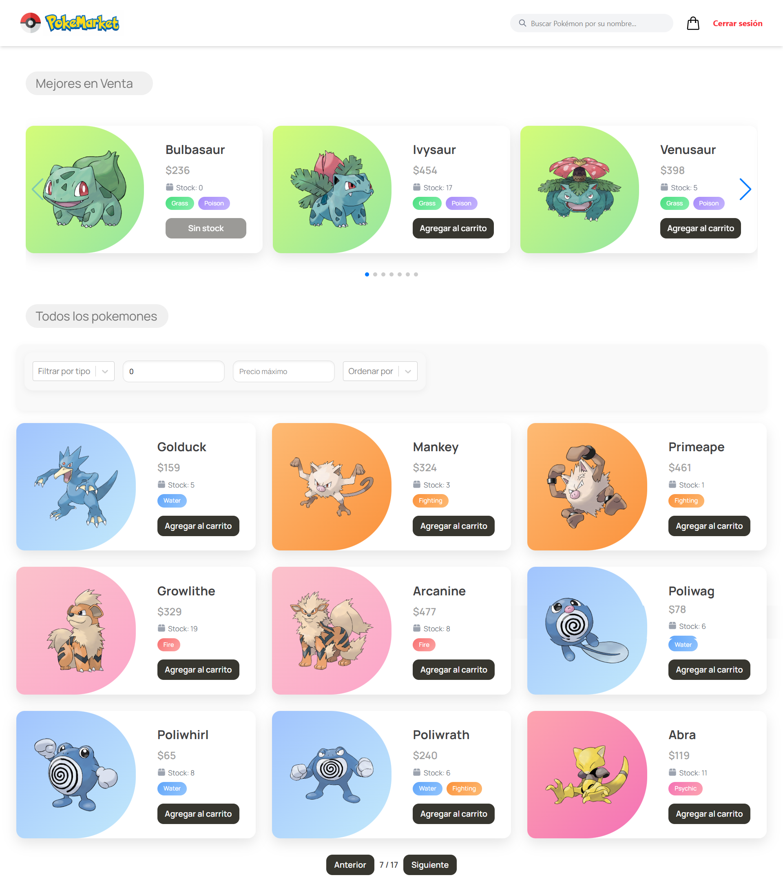
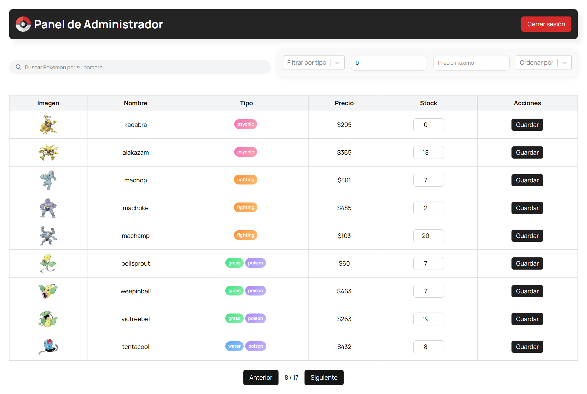
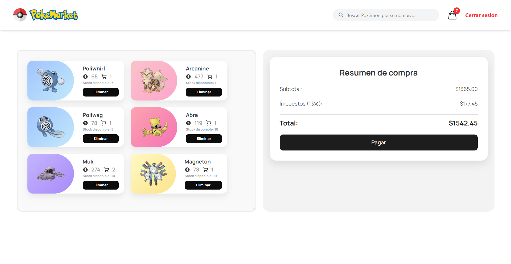
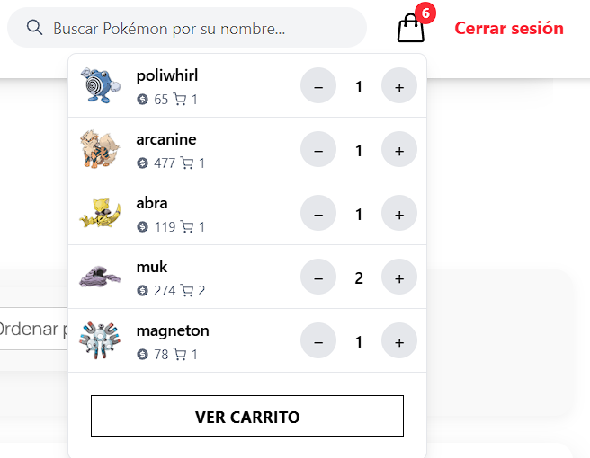

# 

# Pokémon Marketplace

¡Bienvenido a PokéMarket, una aplicación web tipo marketplace desarrollada como **prueba técnica de Frontend**, donde puedes navegar, buscar, filtrar y comprar tus Pokémons favoritos en tiempo real!

Este proyecto está desarrollado utilizando React, TypeScript y Programación Orientada a Objetos (POO), con persistencia de datos en localStorage y un flujo de pago simulado.


## 🌐 Demo en vivo

Puedes probar la aplicación en: [PokéMarket en Vercel](https://tu-proyecto.vercel.app)  

## Usuarios de Prueba

Para la prueba técnica, se han definido los siguientes usuarios simulados:

| Email                   | Contraseña | Rol       |
|-------------------------|------------|-----------|
| admin@pokemarket.com    | 123456     | Administrador |
| buyer@pokemarket.com    | 123456     | Comprador     |

- **Administrador**: puede acceder al panel de administración y modificar el stock de Pokémon.  
- **Comprador**: puede navegar por el catálogo, agregar Pokémon al carrito y simular pagos.


## 🚀 Instalación y ejecución

1. Clona el repositorio:

```bash
git clone https://github.com/AxelAlvarado34/PokeMarket---BetaCode.git
```

2. Instala dependencias:

```bash
npm install
```
3. Crea un archivo .env en la raíz y agrega la URL de la API:

```bash
VITE_API_URL="https://pokeapi.co/api/v2/pokemon?limit=151"
```
4. Ejecuta en modo desarrollo:

```bash
npm run dev
```
5. Abre en tu navegador:

```bash
http://localhost:5173
```

## 💻 Tecnologías utilizadas

- **React + TypeScript**  
- **Zustand** para manejo de estado global  
- **Tailwind CSS** para estilos responsivos  
- **React Hook Form** para formularios  
- **React Toastify** para notificaciones  
- **Axios** para consumo de API (PokéAPI)  
- **POO con Clases**: `Pokemon`, `CartItem`, `Cart`, `Marketplace`  
- **Persistencia en localStorage**  
- **Routing** con React Router  


## 🏗 Arquitectura de proyecto

La estructura de carpetas de este proyecto sigue buenas prácticas de organización y modularidad, permitiendo escalar y mantener la aplicación de manera sencilla:


### Descripción

- **public/**: contiene recursos públicos, incluyendo imágenes y capturas de pantalla que se usan para ilustrar el README o en la app.  
- **src/components/**: componentes reutilizables, como tarjetas de Pokémon, Navbar, botones, dropdowns.  
- **src/data/**: datos simulados para la prueba técnica, como usuarios y roles.  
- **src/helpers/**: funciones auxiliares para notificaciones, utilidades y manejo de datos.  
- **src/layouts/**: layouts generales que permiten mantener consistencia en las páginas.  
- **src/models/**: clases de Programación Orientada a Objetos, que modelan Pokémon, Carrito y Marketplace con métodos como `addToCart()`, `checkout()`, `reduceStock()`.  
- **src/pages/**: páginas principales de la app (Home, Login, Admin).  
- **src/routes/**: definición de rutas con React Router.  
- **src/schemas/**: validaciones con Zod, como formularios y entradas del usuario.  
- **src/store/**: Zustand para gestión de estado global, incluyendo Pokémon y usuarios.  
- **src/styles/**: estilos CSS/Tailwind para mantener la consistencia visual.  
- **src/types/**: tipos TypeScript para tipar objetos y props de componentes.  
- **Archivos raíz** (`package.json`, `tsconfig.json`, `vite.config.ts`) son la configuración de Node, TypeScript y Vite.

Esta organización cumple con los **requisitos de la prueba técnica**, facilitando la implementación de funcionalidades como persistencia en localStorage, simulación de pagos, roles de usuario y uso de POO.


## 📸 Capturas de pantalla

### 🏠 Home  


### 🔐 Login  


### 🛠 Panel de Administrador  


### 💳 Vista de Pago  


### 🛒 Carrito desplegable  

